<h1 align="center">Hi 👋, I'm Pradip Garai</h1>
<h3 align="center">A passionate Backend and DEVOPS Engineer from India</h3>

<!-- ══════════════════════════════════════════ -->
<!--              ANIMATED BANNER              -->
<!-- ══════════════════════════════════════════ -->

  

<!-- Animated typing -->

  

 

## 🌐 Socials:
      

# 💻 Tech Stack:
                          
# 📊 GitHub Stats:
 
 

## 🏆 GitHub Trophies

### ✍️ Random Dev Quote

### 🔝 Top Contributed Repo

---

<!-- Proudly created with GPRM ( https://gprm.itsvg.in ) -->
